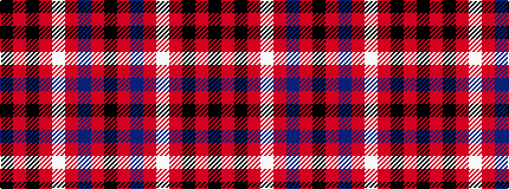

KRBRWRKRK

It is a 9 stripe tartan.

<figure class="pat-woven">

<figcaption>idealised sample</figcaption>
</figure>

## Colour Sequence



## Tartans with this colour sequence

| Tartans |
|---------------|
| [Gipsy](/tartans/k2r2k8r2w1r2db8r2k2/)|
||
| [Gipsy](/setts/s9/k1r1k5r1w1r1db5r1k1~x2/)|
||
