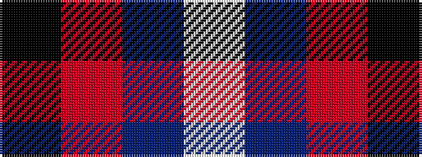

KRBW

It is a 4 stripe tartan.

<figure class="pat-woven">

<figcaption>idealised sample</figcaption>
</figure>

## Colour Sequence



## Tartans with this colour sequence

| Tartans |
|---------------|
| [Kimon Andreou Family (Personal)](/setts/s4/w40t40r1k4~x2/)|
||
| [Kimon Andreou Family (Personal)](/setts/s4/w40b40r1k4~x2/)|
||
