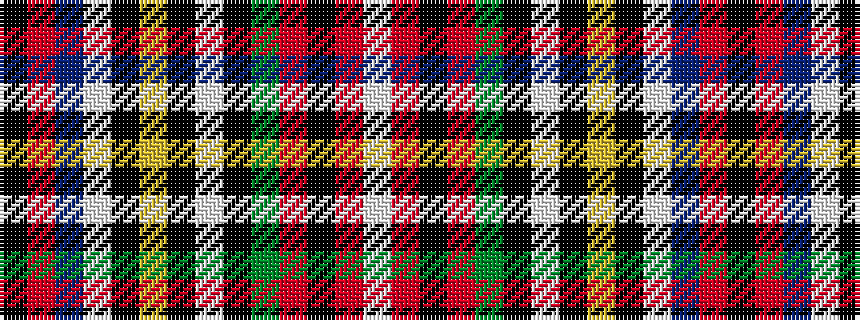

KRBWKYKWKGRKRW

It is a 14 stripe tartan.

<figure class="pat-woven">

<figcaption>idealised sample</figcaption>
</figure>

## Colour Sequence



## Tartans with this colour sequence

| Tartans |
|---------------|
| [Stewart - (Galloway ?)](/variants/s14/k56r90db4w4k13ly3k3w3k3g18r14k3r7w3/)|
||
