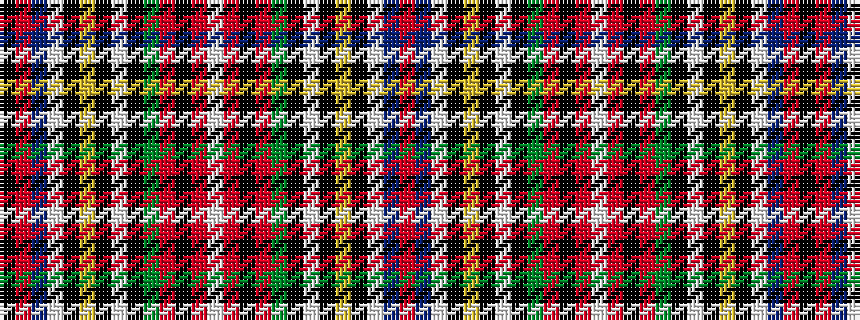

KRBWKYKWKGRKRWRKRGKWKYKWBR

It is a 26 stripe tartan.

<figure class="pat-woven">

<figcaption>idealised sample</figcaption>
</figure>

## Colour Sequence



## Tartans with this colour sequence

| Tartans |
|---------------|
| [Not Specified #3](/setts/s26/r90db4w4k13ly3k3w3k3g18r14k3r7w3r7k3r14g18k3w3k3ly3k13w4db4r90k56/)|
||
