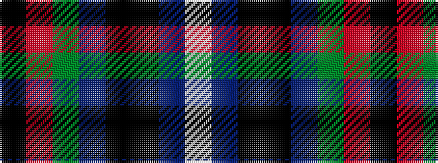

KRGBKKBW

It is a 8 stripe tartan.

<figure class="pat-woven">

<figcaption>idealised sample</figcaption>
</figure>

## Colour Sequence



## Tartans with this colour sequence

| Tartans |
|---------------|
| [American National Fashion Tartan Tartan Number: 6882. Earliest known date: 01/01/2006 Designed by Erica Randall of The House of Edgar for Houston Kilts of Glasgow. Letter of appreciation on Scottish Tartans Authority file from President Bush thanking Ken MacDonald of Houston Kilts for 'the kilt outfit'./Threadcount and colours aren't 100% original. Generated manually./ See products available Copyright © Blair Urquhart, Comrie, 2015](/setts/s8/ki3r3dg4db7ki3k39db15w3~x2/)|
||
