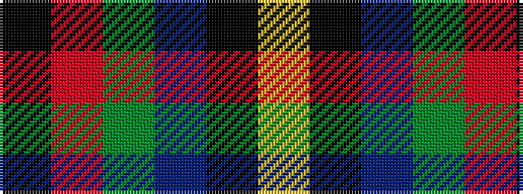

KRGBKY

It is a 6 stripe tartan.

<figure class="pat-woven">

<figcaption>idealised sample</figcaption>
</figure>

## Colour Sequence



## Tartans with this colour sequence

| Tartans |
|---------------|
| [Singh, Gopal (Personal)](/variants/s6/k10r4dg34db34k1lo3~x2/)|
||
