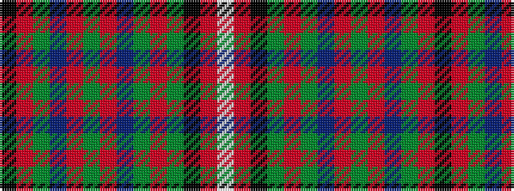

KRGBRGRBGRGKRW

It is a 14 stripe tartan.

<figure class="pat-woven">

<figcaption>idealised sample</figcaption>
</figure>

## Colour Sequence



## Tartans with this colour sequence

| Tartans |
|---------------|
| [MacKinnon #5](/setts/s14/k4r3dg2db2r6dg15r2db4dg2r15dg7k2r4w2~x2/)|
||
| [MacKinnon 12](/setts/s14/k4r3g2db2r6g15r2db4g2r15g7k2r4w2~x2/)|
||
