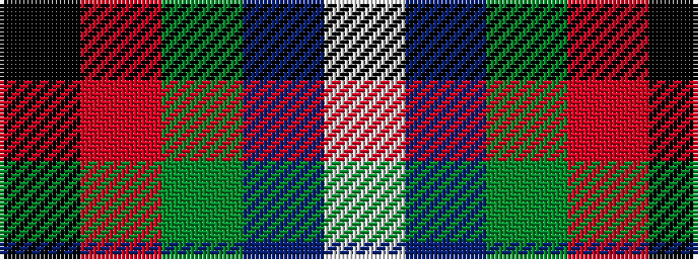

KRGBW

It is a 5 stripe tartan.

<figure class="pat-woven">

<figcaption>idealised sample</figcaption>
</figure>

## Colour Sequence



## Tartans with this colour sequence

| Tartans |
|---------------|
| [Highlander Highland Laddie](/variants/s5/k7r3g30db28lb3~x2/)|
||
| [Highlander, Highland Laddie Kilts](/variants/s5/k7m3g29db29w3~x2/)|
||
