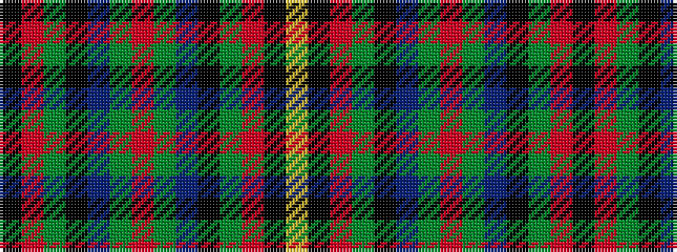

KRGKBGRGBKGRKY

It is a 14 stripe tartan.

<figure class="pat-woven">

<figcaption>idealised sample</figcaption>
</figure>

## Colour Sequence



## Tartans with this colour sequence

| Tartans |
|---------------|
| [Orkney](/variants/s14/k3r13g19k3b19g3r9g3b19k3g19r13k3lo3~x2/)|
||
