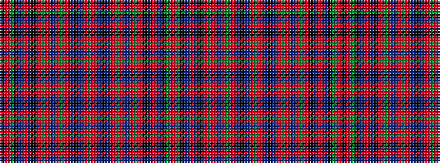

KRGKBRBKRGRBRGRBKBRGRBKBRGRBRGRKBRBKGR

It is a 38 stripe tartan.

<figure class="pat-woven">

<figcaption>idealised sample</figcaption>
</figure>

## Colour Sequence



## Tartans with this colour sequence

| Tartans |
|---------------|
| [Unidentified Cant #07](/setts/s38/g24r24db3k21db3r6g4r6db10r6g4r6k3db11r42db10k6g16r3k21/)|
||
