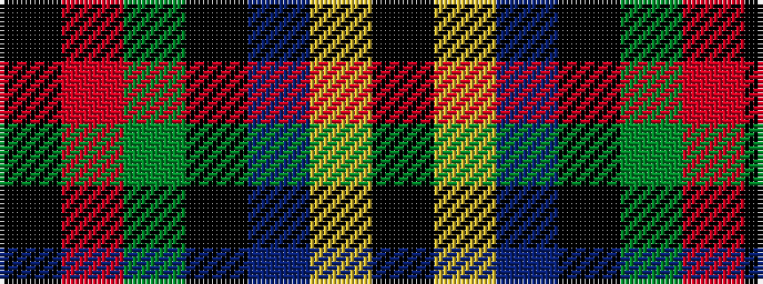

KRGKBYK

It is a 7 stripe tartan.

<figure class="pat-woven">

<figcaption>idealised sample</figcaption>
</figure>

## Colour Sequence



## Tartans with this colour sequence

| Tartans |
|---------------|
| [MacCaskill](/setts/s7/k2r1g15k15db15ly1k2~x2/)|
||
| [MacCaskill (Personal)](/setts/s7/k2r1dg15k15db15ly1k2~x2/)|
||
