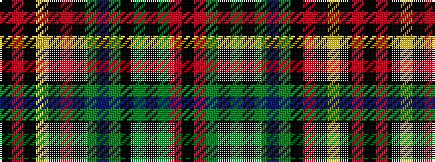

KRGKGKGBGKRKYKRK

It is a 16 stripe tartan.

<figure class="pat-woven">

<figcaption>idealised sample</figcaption>
</figure>

## Colour Sequence



## Tartans with this colour sequence

| Tartans |
|---------------|
| [Large (Personal)](/setts/s16/k2r15y10k2y5k5y2db11y2k2r8k2lo2k2r15k2~x2/)|
||
