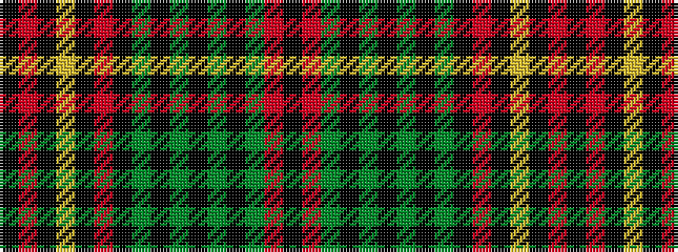

KRGKGKGKGKRKYKRK

It is a 16 stripe tartan.

<figure class="pat-woven">

<figcaption>idealised sample</figcaption>
</figure>

## Colour Sequence



## Tartans with this colour sequence

| Tartans |
|---------------|
| [Large (Personal)](/setts/s16/ki2r17ki2ly2ki2r8ki2y2k11y2ki5y5ki2y10r15ki2~x2/)|
||
