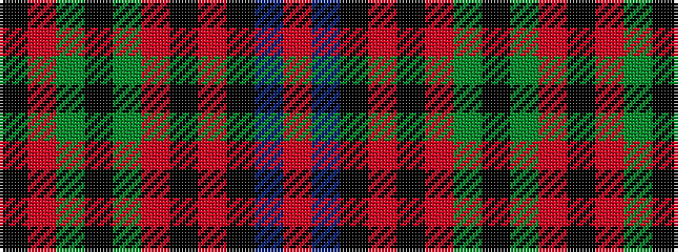

KRGKGRKRKBR

It is a 11 stripe tartan.

<figure class="pat-woven">

<figcaption>idealised sample</figcaption>
</figure>

## Colour Sequence



## Tartans with this colour sequence

| Tartans |
|---------------|
| [State Seal of Virginia (Fashion)](/setts/s11/o49db15k1o18k4r8g7k5g5o19k5~x2/)|
||
