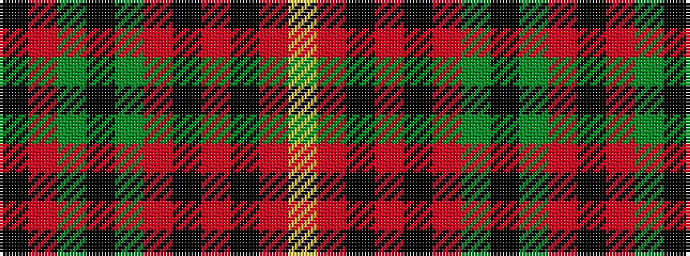

KRGKGRKRKRY

It is a 11 stripe tartan.

<figure class="pat-woven">

<figcaption>idealised sample</figcaption>
</figure>

## Colour Sequence



## Tartans with this colour sequence

| Tartans |
|---------------|
| [Army Cadet Force (Military)](/variants/s11/k9r1g1k3g20r5k3r20k5r3ly2~x2/)|
||
