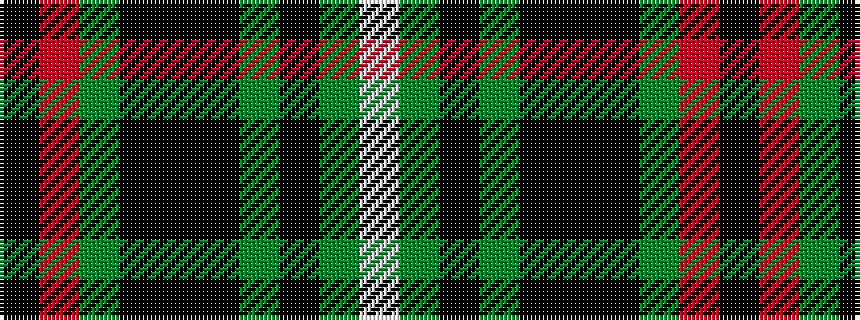

KRGKKKGKGW

It is a 10 stripe tartan.

<figure class="pat-woven">

<figcaption>idealised sample</figcaption>
</figure>

## Colour Sequence



## Tartans with this colour sequence

| Tartans |
|---------------|
| [Scottish Chieftain](/setts/s10/k19r1dg3k2k3k2dg2k2dg20w2~x2/)|
||
