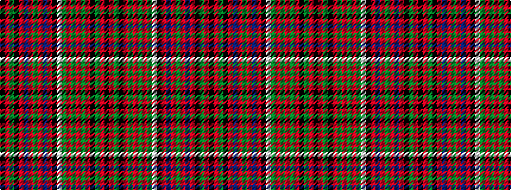

KRGKRBRGRBRKWGRGRGRKGRK

It is a 23 stripe tartan.

<figure class="pat-woven">

<figcaption>idealised sample</figcaption>
</figure>

## Colour Sequence



## Tartans with this colour sequence

This pattern is a design lineage: every tartan below shares one colour order, whatever its owner —
near-identical designs are grouped, the largest lineage first (#112: the pattern is a tartan's
second parent, beside its family or clan).

<table class="sett-table">
<tbody>
<tr><td><a href="/variants/s23/k10r3y3k6r48dg6r2y2r6dg40w2k38r2dp40r6y2r2dp6r48k6y2r3k10/">Hay &amp; Leith - 1800 (Clan)</a></td></tr>
<tr><td class="sett-swatch"></td></tr>
<tr><td><a href="/variants/s23/k3r1y1k2r16dp2r1y1r2dp15r1k15w1g15r2y1r1g2r16k2y1r1k3~x2/">Hay or Leith Clan Tartan</a></td></tr>
<tr><td class="sett-swatch"></td></tr>
<tr><td><a href="/variants/s23/k3r1y1k2r16dp2r1y1r2db15r1k15w1g15r2y1r1g2r16k2y1r1k3~x2/">Hay, or Leith</a></td></tr>
<tr><td class="sett-swatch"></td></tr>
<tr><td><a href="/setts/k3r1y1k2r16db2r1y1r2db15r1k15w1g15r2y1r1g2r16k2y1r1k3/">Leith, (Hay)</a></td></tr>
<tr><td class="sett-swatch"></td></tr>
<tr class="cluster-sep"><td></td></tr>
<tr><td><a href="/setts/k3r1y1k2r16dr2r1y1r2dr15r1k15w1g15r2y1r1g2r16k2y1r1k3/">Hay and Leith</a></td></tr>
<tr><td class="sett-swatch"></td></tr>
</tbody>
</table>

