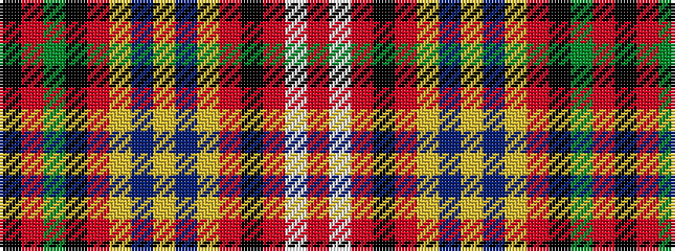

KRGKRYBYBYRKRWR

It is a 15 stripe tartan.

<figure class="pat-woven">

<figcaption>idealised sample</figcaption>
</figure>

## Colour Sequence



## Tartans with this colour sequence

| Tartans |
|---------------|
| [Ruairidh (Personal)](/variants/s15/k6o7dy36k17o17ly34db6ly6db6ly34o17k17r39w4r6/)|
||
