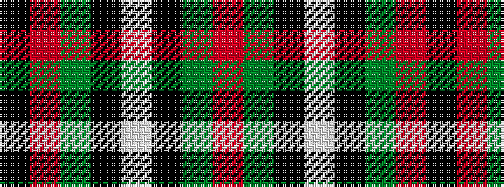

KRGKWKGR

It is a 8 stripe tartan.

<figure class="pat-woven">

<figcaption>idealised sample</figcaption>
</figure>

## Colour Sequence



## Tartans with this colour sequence

| Tartans |
|---------------|
| [MacDiarmid #2](/setts/s8/k83r16dg56k2w5k2dg56r5~x2/)|
||
