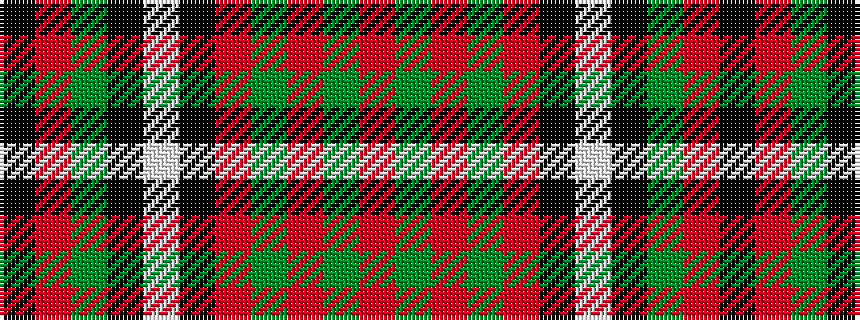

KRGKWKRGRGR

It is a 11 stripe tartan.

<figure class="pat-woven">

<figcaption>idealised sample</figcaption>
</figure>

## Colour Sequence



## Tartans with this colour sequence

| Tartans |
|---------------|
| [Episcopal Clergy (Corporate)](/variants/s11/k1r1g7k8lb1k8r1g2r1g4r1~x4/)|
||
