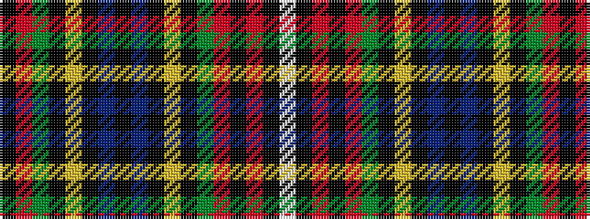

KRGKYKBKBKYKGRKRKW

It is a 18 stripe tartan.

<figure class="pat-woven">

<figcaption>idealised sample</figcaption>
</figure>

## Colour Sequence



## Tartans with this colour sequence

| Tartans |
|---------------|
| [Moon (Georgia, USA)](/setts/s18/lb4k1r5ki3r8dg8k1lo3k1b4ki27b4k1lo3k1dg8r8ki3~x2/)|
||
