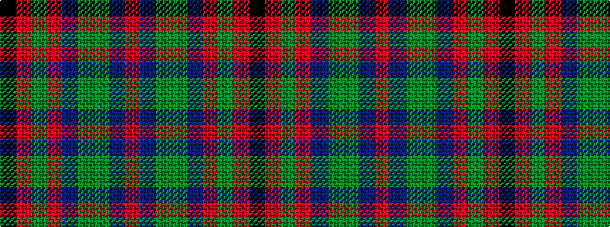

KRGRBGGBR

It is a 9 stripe tartan.

<figure class="pat-woven">

<figcaption>idealised sample</figcaption>
</figure>

## Colour Sequence



## Tartans with this colour sequence

| Tartans |
|---------------|
| [Mann](/variants/s9/k3r2dy4r1db25g12dy14db3r1~x2/)|
||
