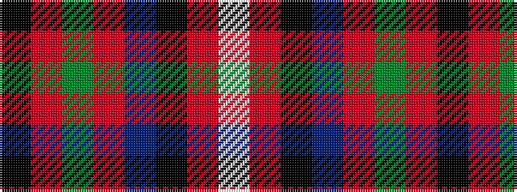

KRGRBKRW

It is a 8 stripe tartan.

<figure class="pat-woven">

<figcaption>idealised sample</figcaption>
</figure>

## Colour Sequence



## Tartans with this colour sequence

| Tartans |
|---------------|
| [Lambert (Front Royal) Greer](/setts/s8/k3r34dg10r5t2k8o2w3~x2/)|
||
