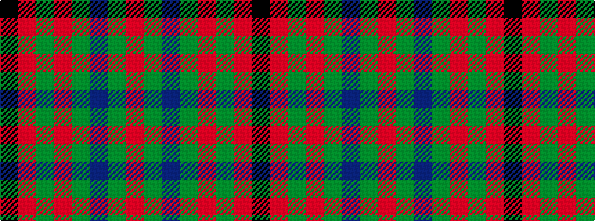

KRGRGBGR

It is a 8 stripe tartan.

<figure class="pat-woven">

<figcaption>idealised sample</figcaption>
</figure>

## Colour Sequence



## Tartans with this colour sequence

| Tartans |
|---------------|
| [Carnegie](/variants/s8/r33g17db50g17r11g17r9k7/)|
||
| [Carnegie #3](/variants/s8/r33dg17db50dg17r11dg17r9k7/)|
||
