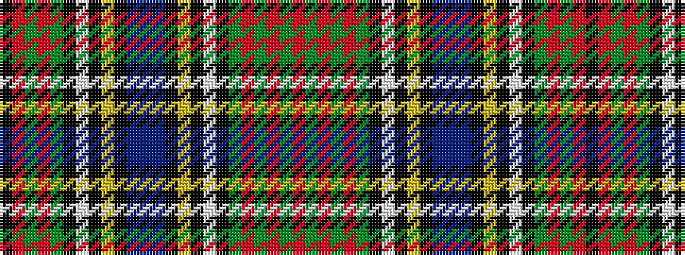

KRGRGKWKYKBBBKYKWKGRGRGR

It is a 24 stripe tartan.

<figure class="pat-woven">

<figcaption>idealised sample</figcaption>
</figure>

## Colour Sequence



## Tartans with this colour sequence

| Tartans |
|---------------|
| [Macan of Lurgyvallan](/variants/s24/r16g1r1g1r1g4k1lb1k1ly1k1t6db4t6k1ly1k1lb1k1g4r12g1r1k1~x4/)|
||
| [Macan, of Lurgyvallan](/variants/s24/r16g1r1g1r1g4k1w1k1ly1k1t6db4t6k1ly1k1w1k1g4r12g1r1k1~x2/)|
||
