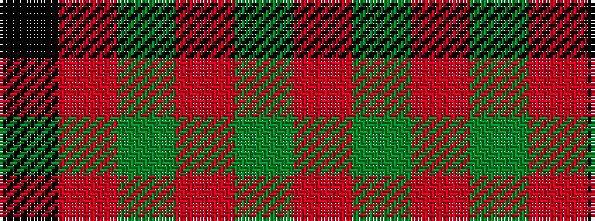

KRGRGR

It is a 6 stripe tartan.

<figure class="pat-woven">

<figcaption>idealised sample</figcaption>
</figure>

## Colour Sequence



## Tartans with this colour sequence

| Tartans |
|---------------|
| [Connell (Personal?)](/setts/s6/r2g2r1g12r3k1~x4/)|
||
