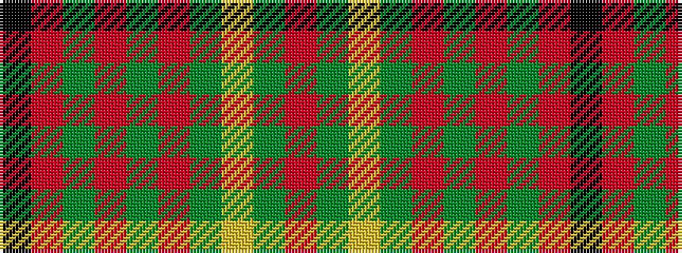

KRGRGRGYGR

It is a 10 stripe tartan.

<figure class="pat-woven">

<figcaption>idealised sample</figcaption>
</figure>

## Colour Sequence



## Tartans with this colour sequence

| Tartans |
|---------------|
| [Cumming VS](/setts/s10/r4dg8lr1dg8r4dg4r2dg4r24k2~x2/)|
||
