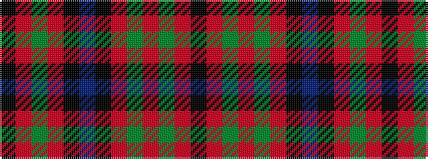

KRGRGRKBKRGRK

It is a 13 stripe tartan.

<figure class="pat-woven">

<figcaption>idealised sample</figcaption>
</figure>

## Colour Sequence



## Tartans with this colour sequence

| Tartans |
|---------------|
| [MacNicol D](/setts/s13/k2r10dg2r10dg13r2k6b2k8r10dg2r10k2~x2/)|
||
| [MacNicol D](/setts/s13/k2r10dg2r10dg13r2k6b2k8r10dg2r10k2/)|
||
| [Nicolson, MacNicol](/setts/s13/k2r8g2r8g14r2k6t1k7r8g2r8k2~x2/)|
||
