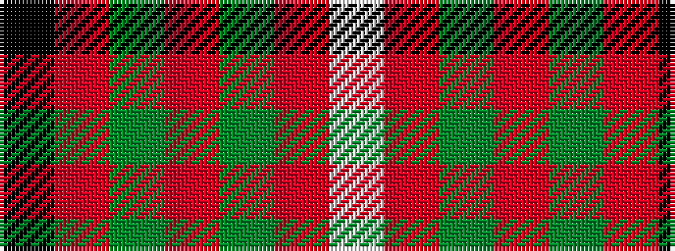

KRGRGRW

It is a 7 stripe tartan.

<figure class="pat-woven">

<figcaption>idealised sample</figcaption>
</figure>

## Colour Sequence



## Tartans with this colour sequence

| Tartans |
|---------------|
| [MacKinnon #4](/setts/s7/k1r18dg12r2dg12r18w1~x2/)|
||
| [MacKinnon 8](/setts/s7/k1r18g12r2g12r18w1~x2/)|
||
