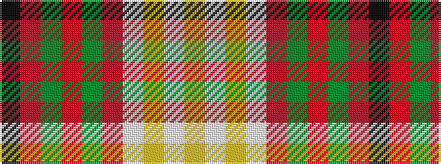

KRGRGRWYWY

It is a 10 stripe tartan.

<figure class="pat-woven">

<figcaption>idealised sample</figcaption>
</figure>

## Colour Sequence



## Tartans with this colour sequence

| Tartans |
|---------------|
| [Melieres, Carolyn (Personal)](/variants/s10/ly4w2ly2w8r16g3r3g8r6k2~x2/)|
||
