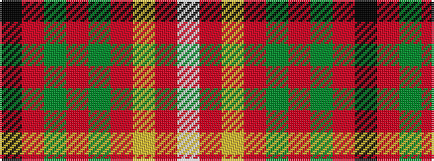

KRGRGRYRW

It is a 9 stripe tartan.

<figure class="pat-woven">

<figcaption>idealised sample</figcaption>
</figure>

## Colour Sequence



## Tartans with this colour sequence

| Tartans |
|---------------|
| [Melieres, Michel (Personal)](/setts/s9/k2r1g8r3g3r14ly1r1w2~x2/)|
||
