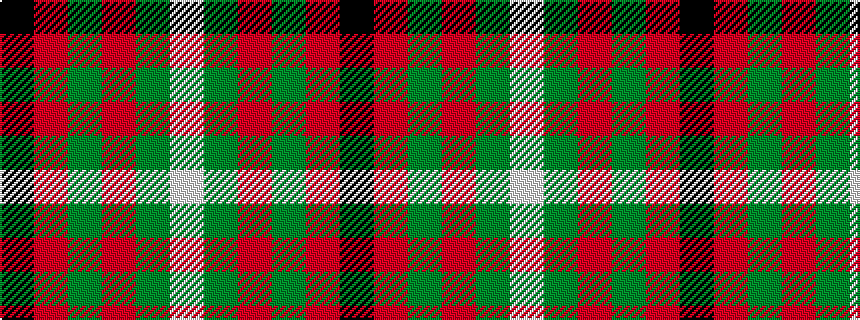

KRGRGW

It is a 6 stripe tartan.

<figure class="pat-woven">

<figcaption>idealised sample</figcaption>
</figure>

## Colour Sequence



## Tartans with this colour sequence

| Tartans |
|---------------|
| [MacAulay](/setts/s6/k2r16g6r3g8lb1~x2/)|
||
| [MacAulay](/tartans/k2r16g6r3g8w1/)|
||
| [MacAulay](/setts/s6/k2r16dg6r3dg8lb1/)|
||
