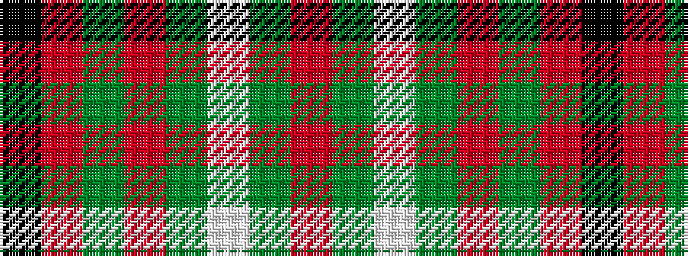

KRGRGWGR

It is a 8 stripe tartan.

<figure class="pat-woven">

<figcaption>idealised sample</figcaption>
</figure>

## Colour Sequence



## Tartans with this colour sequence

| Tartans |
|---------------|
| [Comyn](/setts/s8/k1r9dg2r2dg4lb1dg4r1~x2/)|
||
| [Cumming #2](/setts/s8/r3g9w1g9r3g6r18k2~x2/)|
||
| [Cumming SM](/setts/s8/r3dg9lb1dg9r3dg6r18k2~x2/)|
||
