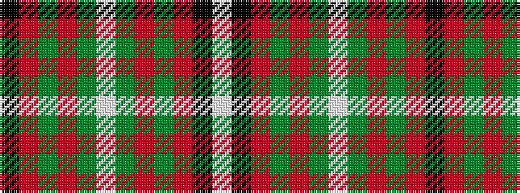

KRGRGWGRGRKW

It is a 12 stripe tartan.

<figure class="pat-woven">

<figcaption>idealised sample</figcaption>
</figure>

## Colour Sequence



## Tartans with this colour sequence

| Tartans |
|---------------|
| [MacMaster Clan/Family Tartan Tartan Number: 3493. Earliest known date: 1986 Designed by Phil Smith in 1986 for all of the names MacMaster, MacMasters etc. See MacMasters Canada. See products available Copyright © Blair Urquhart, Comrie, 2015](/setts/s12/k1r14g1r1g6lb2g6r1g1r14k1lbi1~x4/)|
||
