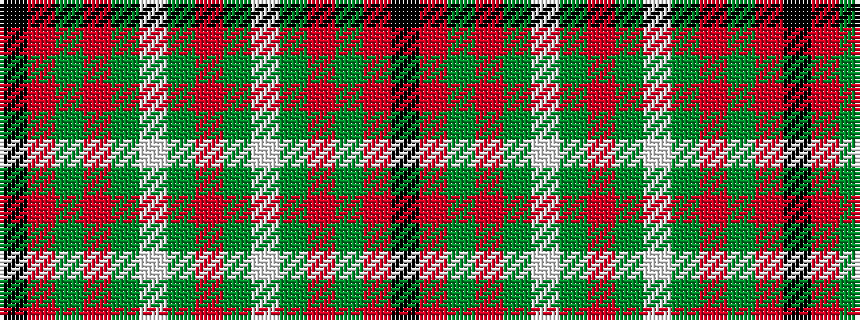

KRGRGWGRGWGRGRK

It is a 15 stripe tartan.

<figure class="pat-woven">

<figcaption>idealised sample</figcaption>
</figure>

## Colour Sequence



## Tartans with this colour sequence

| Tartans |
|---------------|
| [MacAulay](/setts/s15/k2r18g7r3g10w1g10r3g10w1g10r3g7r18k1~x4/)|
||
