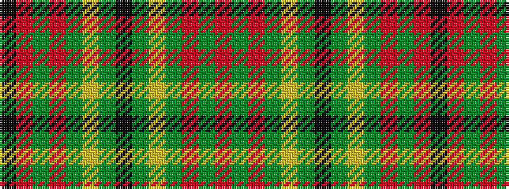

KRGRGYGKGYGRGR

It is a 14 stripe tartan.

<figure class="pat-woven">

<figcaption>idealised sample</figcaption>
</figure>

## Colour Sequence



## Tartans with this colour sequence

| Tartans |
|---------------|
| [Oakhall](/setts/s14/r48g6r6g12ly3g2k3g2ly3g12r6g6r48k3~x2/)|
||
