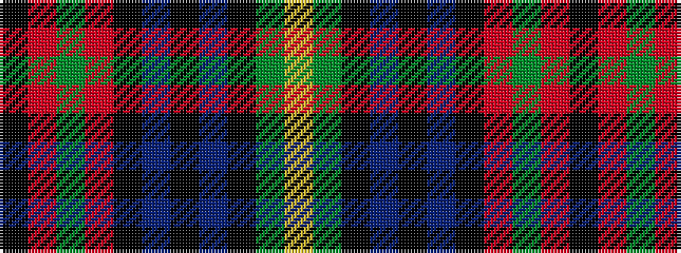

KRGRKBKBKGY

It is a 11 stripe tartan.

<figure class="pat-woven">

<figcaption>idealised sample</figcaption>
</figure>

## Colour Sequence



## Tartans with this colour sequence

| Tartans |
|---------------|
| [MacBrine (Name)](/variants/s11/k4r6g8r16k6db10k2db10k2g8ly1~x2/)|
||
