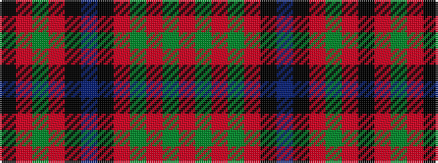

KRGRKBKRGRGR

It is a 12 stripe tartan.

<figure class="pat-woven">

<figcaption>idealised sample</figcaption>
</figure>

## Colour Sequence



## Tartans with this colour sequence

| Tartans |
|---------------|
| [MacLeod and MacNicol](/variants/s12/r8dg1r8dg16r4k2t1k4r8dg1r8k1~x2/)|
||
| [MacLeod, and MacNicol](/variants/s12/r8g1r8g16r4k2t1k4r8g1r8k1~x2/)|
||
