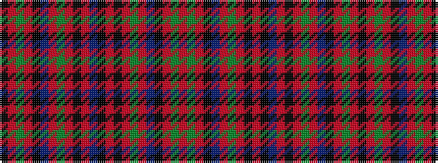

KRGRKBRGRKRBKRKRGRBKRGR

It is a 23 stripe tartan.

<figure class="pat-woven">

<figcaption>idealised sample</figcaption>
</figure>

## Colour Sequence



## Tartans with this colour sequence

| Tartans |
|---------------|
| [Cumming Hunting](/variants/s23/k1r1g8r1k6t1r6g6r1k8r1t1k1r1k8r1g6r6t1k6r1g8r1~x4/)|
||
