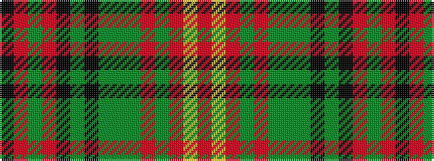

KRGRKGKGGGRGRYR

It is a 15 stripe tartan.

<figure class="pat-woven">

<figcaption>idealised sample</figcaption>
</figure>

## Colour Sequence



## Tartans with this colour sequence

| Tartans |
|---------------|
| [Scottish Register of Tartans' Tartan](/setts/s15/r12lr4r7dy2r2dy28dy2dy28k2dy2k23r3y6r3k5/)|
||
