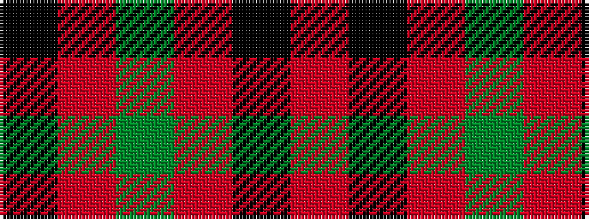

KRGRKR

It is a 6 stripe tartan.

<figure class="pat-woven">

<figcaption>idealised sample</figcaption>
</figure>

## Colour Sequence



## Tartans with this colour sequence

| Tartans |
|---------------|
| [MacAn of Lurgyvallan (Hose)](/variants/s6/r9k1r5g6r4k2~x4/)|
||
| [Macan, of Lurgyvallan (Hose)](/variants/s6/r10k1r4g6~x2/)|
||
