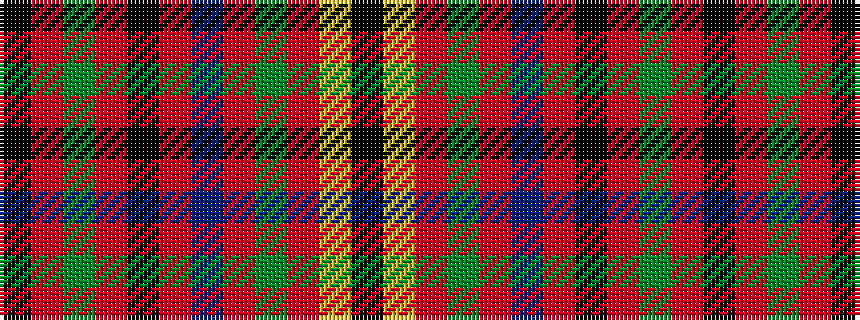

KRGRKRBRGRYK

It is a 12 stripe tartan.

<figure class="pat-woven">

<figcaption>idealised sample</figcaption>
</figure>

## Colour Sequence



## Tartans with this colour sequence

| Tartans |
|---------------|
| [MacClure Clan/Family Tartan](/variants/s12/k2lr1r2g6r2db4r2k2r15g2r2k1~x4/)|
||
