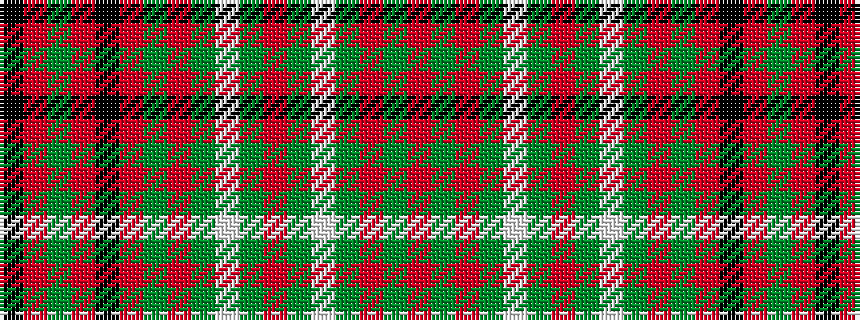

KRGRKRGRGWGRGWGRGR

It is a 18 stripe tartan.

<figure class="pat-woven">

<figcaption>idealised sample</figcaption>
</figure>

## Colour Sequence



## Tartans with this colour sequence

| Tartans |
|---------------|
| [Scott](/setts/s18/r16g8r2g2w2g2r2g2w2g2r2g8r16k1r2g3r2k1~x2/)|
||
