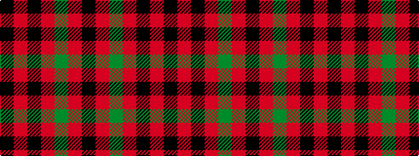

KRGRKRK

It is a 7 stripe tartan.

<figure class="pat-woven">

<figcaption>idealised sample</figcaption>
</figure>

## Colour Sequence



## Tartans with this colour sequence

| Tartans |
|---------------|
| [Logan (Dark)](/setts/s7/k15r4k1r4dg15r4k1~x4/)|
||
| [Logan - 1810 (Cockburn Collection)](/setts/s7/k14r6k2r6dg25r6k2~x2/)|
||
| [Logan, Dark](/setts/s7/k9r4k1r4g15ri4k1~x2/)|
||
