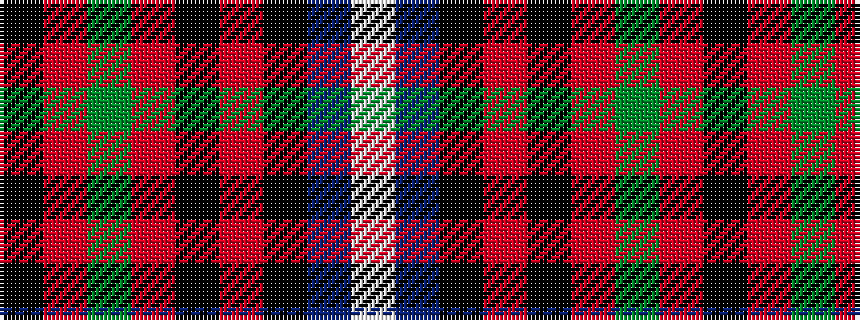

KRGRKRKBW

It is a 9 stripe tartan.

<figure class="pat-woven">

<figcaption>idealised sample</figcaption>
</figure>

## Colour Sequence



## Tartans with this colour sequence

| Tartans |
|---------------|
| [Edinburgh](/setts/s9/w3db22k2r3k2r5g7r2k2~x2/)|
||
