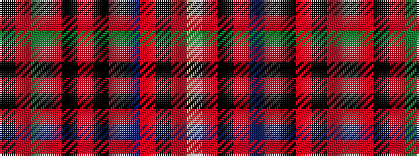

KRGRKRKRBRKRY

It is a 13 stripe tartan.

<figure class="pat-woven">

<figcaption>idealised sample</figcaption>
</figure>

## Colour Sequence



## Tartans with this colour sequence

| Tartans |
|---------------|
| [Prince Charles Edward (Edinburgh)](/setts/s13/ly3r3k5r2db9r7k1r3k1r7g7r2k2~x2/)|
||
