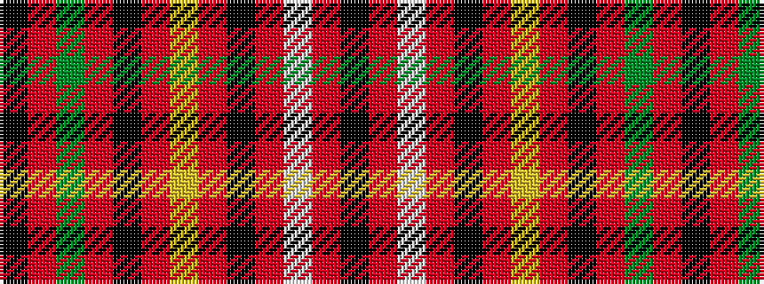

KRGRKRYRKRWRK

It is a 13 stripe tartan.

<figure class="pat-woven">

<figcaption>idealised sample</figcaption>
</figure>

## Colour Sequence



## Tartans with this colour sequence

| Tartans |
|---------------|
| [MacKeever (Personal)](/setts/s13/k36r8w2r2k2r2ly2r24k3r2g6r2k8~x2/)|
||
