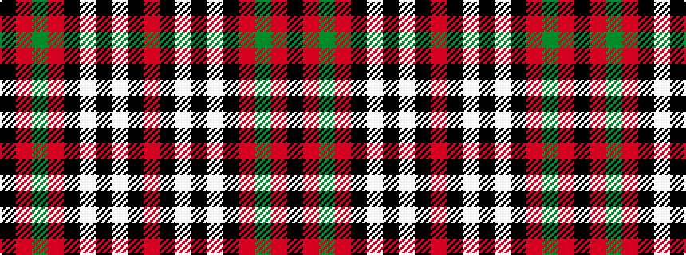

KRGRKWKWKR

It is a 10 stripe tartan.

<figure class="pat-woven">

<figcaption>idealised sample</figcaption>
</figure>

## Colour Sequence



## Tartans with this colour sequence

| Tartans |
|---------------|
| [Woodberry Forest School (Corporate)](/variants/s10/r6k3w3k3w3k34r6g5r6k5~x2/)|
||
