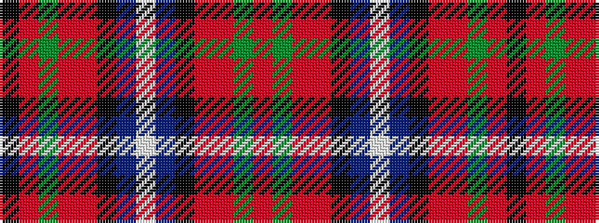

KRGRRKBWBKRRGR

It is a 14 stripe tartan.

<figure class="pat-woven">

<figcaption>idealised sample</figcaption>
</figure>

## Colour Sequence



## Tartans with this colour sequence

| Tartans |
|---------------|
| [Lambert (Front Royal) Hunting](/setts/s14/o34dg10o5r2k8t2w3t2k8r2o5dg10o28k3~x2/)|
||
