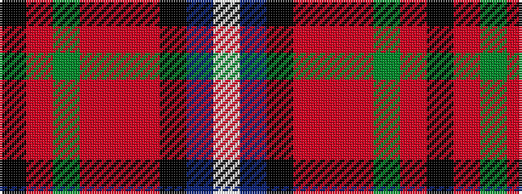

KRGRRRKBW

It is a 9 stripe tartan.

<figure class="pat-woven">

<figcaption>idealised sample</figcaption>
</figure>

## Colour Sequence



## Tartans with this colour sequence

| Tartans |
|---------------|
| [Dunedin](/variants/s9/k3r3g21ri8r3ri4k3db26w3~x2/)|
||
| [Dunedin (USA)](/variants/s9/k3r3g21r8ri3r3k3t25w3~x2/)|
||
